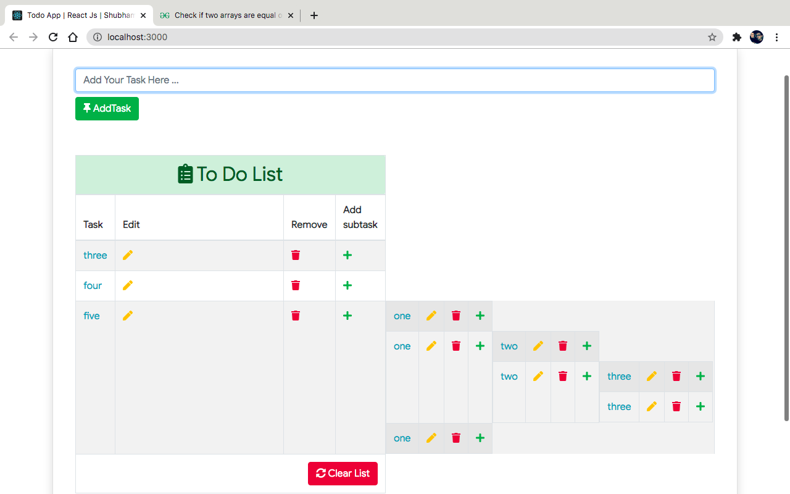

# Daily Todo List

> A nested todo app with subtasks and browser persistence — learn React state and hierarchical data without a backend.



## Purpose

A nested todo app with subtasks and browser persistence — learn React state and hierarchical data without a backend.

## Use Cases

- Personal task tracking
- Learning localStorage CRUD
- Practicing nested list UI patterns

## Tech Stack

- React 16
- Bootstrap 4
- localStorage
- Create React App

## How to Run Locally

```bash
npm install && npm run dev
```

## Live Demo

[https://shubhamsahaniNitkkr.github.io/todo-list-app-reactjs/](https://shubhamsahaniNitkkr.github.io/todo-list-app-reactjs/)


## Performance & UI

- Mobile-responsive layout
- Optimized static assets where applicable
- Runs independently from the portfolio hub

---

Part of [Old Basic Projects](../README.md) portfolio.
